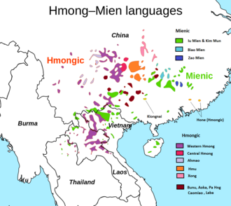
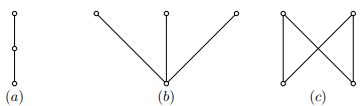
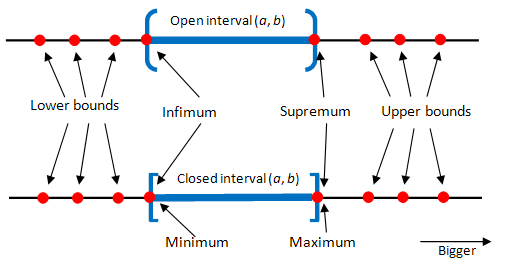
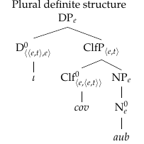
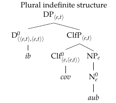
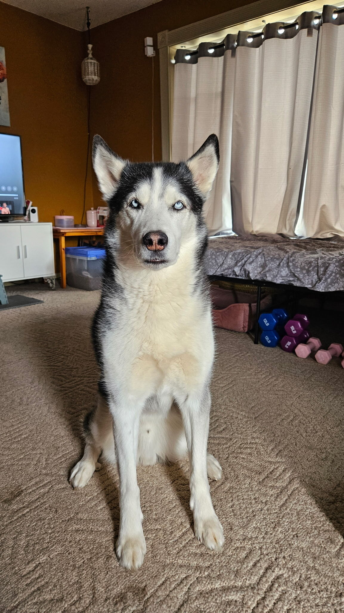
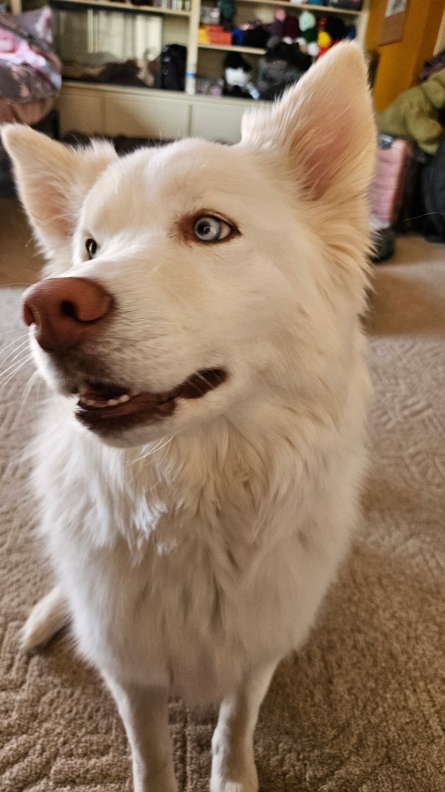

# Introduction

- In this paper, I show that Hmong *cov* is a plural classifier that generates a set of subsets (a **cover**). 

--

- Classifiers in White Hmong (Hmong-Mien) typically give rise to definite readings via an ι operator in the absence of an indefinite article. 

--

- The plural, group classifier *cov* generates a cover that can be seen clearly in definite and indefinite contexts.

---

# Introduction

### Research questions for broader project

1. What are the individual meanings of *ib*, *tus*, and *cov*?

  - ***ib***: indefinite article
  
  - ***tus***: general singular classifier
  
  - ***cov***: general plural classifier 
  
--

2. How do the indefinite article *ib* and the classifiers *tus* and *cov* combine to give us the correct meanings for each possible DP configuration in Hmong?

--

**Investigating this made me realize that Hmong's plural classifier is really interesting...**

--

(So is the indefinite article, but that's not the focus for today!)
---

# Introduction

1. Introduction 

2. Hmong background 

3. Literature 

4. Hmong data

5. Proposal 

6. Discussion

7. Conclusion

---

class: center, middle

# Hmong background

---

# Hmong background

### Morphosyntax

- strict SVO word order

- no case or grammatical gender distinction 

--

### Semantics

- no definite article

- bare classifier phrases are definite 

- bare nouns are only grammatical as kinds

--

(1) **tsov** ntxaus ntxaus ntshai

<span style="color:white;">(1)</span> tiger intensifier REDUP fear 

<span style="color:white;">(1)</span> *"Tigers are dangerous."*


---

# Hmong background

### Phonology 

- monosyllabic CV words **(no consonant codas!)**

--

### Romanized Popular Alphabet (RPA)

- in RPA, the final letter of the word corresponds to a ***tone***!

--

- 7 tones
  - high rising (***-b***) 
  - high falling (***-j***)
  - mid (***unmarked***)
  - low (***-s***)
  - mid-rising (***-v***)
  - low-falling creaky (***-m***)
  - high-falling breathy (***-g***)


---

class: center, middle

```{r, out.width="50%", out.height="50%", echo=FALSE}

```

West Hmongic branch

~4.5 million speakers

Diaspora communities in the US speak **White Hmong** and **Green Hmong** and are mainly from Laos, Thailand or Vietnam

---

# Hmong background

### The consultants

- All data and discussion are based on elicitation on Zoom with **Ying** (35) and in person with **Keng** (25), two (sibling!) White Hmong speakers who were raised in Wisconsin (WI). 

--

- **Keng:** White Hmong, English, high school German 

- **Ying:** White Hmong, English, high school Japanese 

--

- Keng was born in WI and Ying immigrated to the US from Laos at age 4.

- neither speaker can read/write Hmong

---

class: center, middle

# Hmong data

---

# Hmong data

## Singular DPs 

.pull-left[
(2) Keng pom **tus aub** 

<span style="color:white;">(1)</span> Keng see CLF dog 

<span style="color:white;">(1)</span> *"Keng sees the dog."*

(3) Keng pom **ib tus aub** 

<span style="color:white;">(1)</span> Keng see INDEF CLF dog 

<span style="color:white;">(1)</span> *"Keng sees a/some dog."* 
]


.pull-right[
(2) ***tus aub*** can only refer to 1 unique, specific dog in the relevant context

(3) ***ib tus aub*** can refer to any one of the dogs in the context 
]

---

# Hmong data 

## Plural DPs

.pull-left[
(4) Keng pom **cov** **aub**

<span style="color:white;">(1)</span> Keng see CLF dog

<span style="color:white;">(1)</span> *"Keng sees (all) the dogs."*


(5) Keng pom **ib** **cov** **aub**

<span style="color:white;">(1)</span> Keng see INDEF CLF dog 

<span style="color:white;">(1)</span> *"Keng sees (some of) the dogs."*
]

.pull-right[
(4) ***cov aub*** can only refer to the full group of dogs in the context

(5) ***ib cov aub*** can refer to any subgroup of the dogs in the context 

]

---

class: center, middle

# Literature

---

# Literature 

## Hmong-specific

- there is minimal semantic work on Hmong and previous discussion of classifiers is brief, descriptive, and focused on classifier choice (Bisang 1993)

- some work on bare classifier phrases in Hmong being definite (Simpson 2008; Simpson 2011; Simpson et. al 2015)

--

- **that's about it!**

---

# Literature 

## Link (1983)

This paper is about collective predication

Lattice structures inherent in *mereological predicate logic*

--

**Mereology:** the study of parthood

- The operator **⊕ ** allows us to put individuals together to form "collections" and the formal object of them is called a SUM

- a sum is an **individual, not a set**

---

# Literature 

### Link (1983)

**Join-semilattice:** is a partially ordered set in which all pairs have a join

- the join of a subset $S$ of a partially ordered set $P$ is the **supremum** of $S$ ( $\lor$ $S$ )

- (*a*) and (*b*) are join-semilattices but (*c*) is not (visual is from [this paper](https://math.hawaii.edu/~jb/math618/os2uh_17.pdf))

```{r, out.width="90%", out.height="90%", echo=FALSE}

```


---

# Literature 

### Supremum

  - **supremum:** the smallest number that is greater than or equal to every element in the set
  
  - the supremum doesn't have to be an element of the set
  
  - supremum always exists for a set that is bounded above and is unique when it exists

---

# Literature 

### Supremum (visual)

```{r, out.width="100%", out.height="100%", echo=FALSE}

```

This helpful graphic is from [this website](https://mathstrek.blog/2012/11/09/basic-analysis-sequence-convergence-1/).

---

class: center, middle

# Proposal

---

# Proposal 

- The two DP structures with ***cov***...

.pull-left[
```{r, out.width="80%", out.height="80%", echo=FALSE}

```
]

.pull-right[
```{r, out.width="90%", out.height="90%", echo=FALSE}

```
]

---

# Proposal 

- Recall bare N is type *e*

- So, the lexical contribution of *cov* is to convert a type *e* bare noun (a kind) into a property *e,t* (Chierchia 1998) and generate a **cover**

  - A **cover**  generates a set of subsets of entities that fit the noun’s descriptive content in the context

---

# Proposal 

### Formal definition

.pull-left[
(6) **Cov** *covers* A if: (Schwarzschild 1996)

  - **Cov** is a set of subsets of A
  
  - Every member of A belongs to some set in **Cov**
  
  - ∅ is not in **Cov**
  
  - **Cov***(A) = ℘(A), without ∅
]

--

.pull-right[
(7) [[*cups*]]<sup>*M,g*</sup> = 

  - {{c1 ⊕ c2 ⊕ c3 },

  - <p style="font-size: 14pt;">{c1 ⊕ c2 }, {c1 ⊕ c3 }, {c2 ⊕ c3 },</p>

  - {c1}, {c2}, {c3}}
  
  - *cups = ℘(cup), without ∅*
]

---

# Proposal

- *cov* generates a cover of things in the relevant situation context that are of the property P.

(8) [[*cov*]]<sup>*M,g*</sup> = λP.λx.x ∈ **Cov**(P)

--

- this *cov* doesn’t operate over kinds and instead operates over properties

- assume there is an up operator (following Chierchia 1998) coupled with the *cov* denotation to show that *P* must be a property by the time *cov* combines with the noun, though this operator is not explicitly shown in my denotations

--

- now at the ClfP level of the structures, we have a property type (*e,t*)

---

# Proposal 

### The determiners: iota

- there are two relevant D options: ι, a **null morpheme** which gives a definite reading, and *ib*, which gives a very non-specific indefinite reading.

- I adopt the following formulation of ι (Jenks 2018)

(9) [[ι]] = λP : ∃!x[P(x)].ιx[P(x)]

---

# Proposal

### A determiner: *ib*

-  For the indefinite article *ib*, I analyze it as a choice function indefinite (Winter 1997) rather than an existential quantifier.

(10) [[*ib*]]<sup>*M,g*</sup> = λP. *f*<sub>*cf*</sub> (λy.P(y) = 1)

--

- A choice functional definition for *ib* more clearly explains the fact that Hmong indefinite *ib cov* DPs have a non-specific meaning and they select a random subset from the powerset generated by *cov*. 

- *ib* has a primary function of choosing a subset from the set of options in the context


--

- Once the DP structures are built via standard functional application, we see ***antipresupposition***

---

# Proposal

### Antipresupposition

- Antipresupposition must be visible at the DP level since it takes the semantics of the determiner (iota or *ib*) into account 

--

- In the case of *ib cov aub*, the choice function does not select the largest entity; otherwise, the definite (null) ι would be the determiner chosen for the utterance instead of *ib*

- The choice function also does not select an atomic entity; otherwise, the singular classifier *tus* would have been chosen instead of *cov*

--

- This antipresupposition yields the non-singular and non-maximal entities as the pragmatically sound options when *ib cov aub* is uttered

---

# Contexts

(11) *AUB*<sub>*C*</sub>: \{Apollo,Mars,Copper\}

<span style="color:white;">(1)</span> (a.) *tus aub* = A

<span style="color:white;">(1)</span> (b.) *ib tus aub* = A or M or C

(12) *AUB*<sub>*C*</sub>: \{Apollo,Mars,Copper\}

<span style="color:white;">(1)</span> (a.) *cov aub* = AMC 

<span style="color:white;">(1)</span> (b.) *ib cov aub* = AMC or AM or AC or CM or A or M or C

<span style="color:white;">(1)</span> (c.) *ib cov aub* = AM or AC or CM (**via antipresupposition!**)

---

# Discussion & Implications 


- **First,** the only defining characteristic of a classifier in Hmong (and likely other Chinese-type languages) is to convert a kind into a property. 

  - I have not applied this analysis to any languages with optional classifiers.

--

- **Second,** we expect plural classifiers in any language to have this cover property, *so long as* the classifier is the sole morphological contributor to the plurality of the noun phrase.

---

# Discussion & Implications

- This is an interesting prediction for **Mandarin**, which has also been said to have a plural classifier ***xie*** (Wu 2019). 

- It’s not clear without more thorough investigation whether indefinite ***xie*** phrases are compatible with this Hmong analysis because we would first need to establish:

  - that the word for 'one’ ***yi*** is a choice function indefinite 
  
  - that ***xie*** is a plural classifier

---

# Discussion & Implications

***discuss Persian DOM data, Jasbi 2015???***


ketab-o = "the book"

ye kitab-o = "(one of) the cakes" or "a cake"

- (unknown/nonspecific one of a relevant group) 

- (partitive reading)

kitaba-ro = 

ye kitab = "a book"

--

*ye* = indef determiner

- An indefinite is partitively specific if it is interpreted as part  of a set introduced in previous discourse.


māshin = the car

ye māshin = a car

māshin-i = a/any car

ye māshin-i = some car or other


---

# Conclusion 

- My analysis is unique in that it explains definiteness facts as well as the number facts of definite and indefinite uses of *cov*.

--

- This may extend to other classifier languages with a general plural classifier!

--

class: middle, center

# Cov aub 😄

```{r, out.width="17%", out.height="12%", dpi=900, echo=FALSE}






```


---

# References 1

Bisang, W. 1993 . ‘Classifiers, quantifiers and class nouns in Hmong’, *Studies in Language* 17 : 1–
51.

Chierchia, Gennaro. 1998. Reference to kinds across language. *Natural Language Semantics*
6:339–405.


Chierchia, Gennaro. 1997. Partitives, Reference to Kinds and Semantic Variation. *SALT VII*, 73-98.
Cornell University. Ithaca, NY.


Elbourne, Paul D. 2005. On the acquisition of Principle B. Linguistic Inquiry 36:333–366

**Jasbi 2016**

---

# References 2


Jenks, Peter. 2018. Articulated definiteness without articles. Linguistic Inquiry 49:501–536.

**Link 1983**

Percus, O. 2006. "Antipresuppositions." In A. Ueyama(ed.), Theoretical and Empirical Studies of Reference and Anaphora: Toward the establishment of generative grammar as an empirical science, Report of the Grant-in-Aid for Scientific Research (B), Project No. 15320052, Japan Society for the Promotion of Science, 52-73. 

Schwarzschild. 1996. *Pluralities*, Springer.

Simpson. 2008. "Classifiers and DP Structure in South Asia" in The oxford handbook of comparative
syntax. Cinque, G., & Kayne, R. S. (Eds.). Oxford University Press, Incorporated. Created from
rutgers-ebooks on 2025-02-17 20:33:03.

Simpson et. al. 2011. Bare classifiers and definiteness. *Studies in Language* 35:1 (2011), 168–193. doi
10.1075/sl.35.1.10sim

---

# References 3

https://math.hawaii.edu/~jb/math618/os2uh_17.pdf

[this too???](https://mathstrek.blog/2012/11/09/basic-analysis-sequence-convergence-1/)

Winter, Y. 1997. Choice Functions and the Scopal Semantics of Indefinites. Linguistics and Philosophy 20, 399–467. https://doi.org/10.1023/A:1005354323136
 
Wu, Yi-Chi. 2019. Plural Classifier xie and Grammatical Number in Mandarin Chinese. *Berkeley Papers in Formal Linguistics* 2(1).

---

class: center, middle

# Thank you! Questions? Comments?

### contact: quartz.colvin@rutgers.edu


---

# Appendix A

## Formal derivations 

***insert later???***

